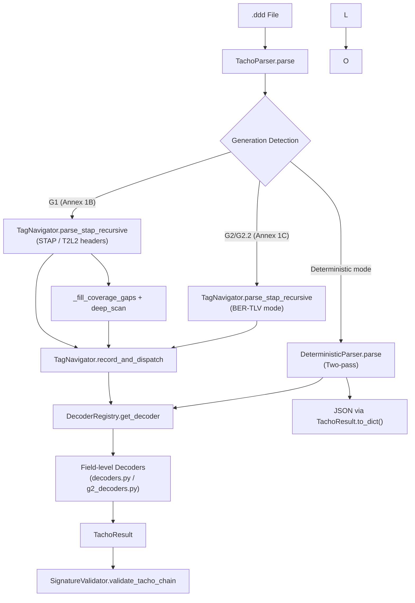
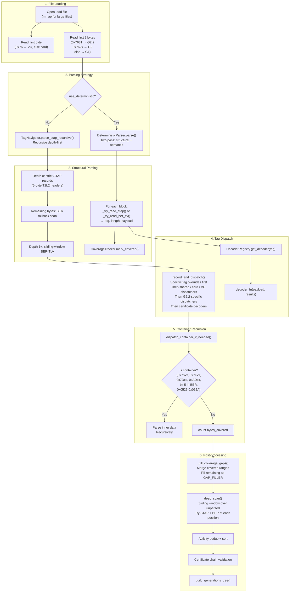

# Architecture

## Architecture Overview

The DDD Tachograph Reader follows a layered pipeline architecture with four main layers:

1. **Parser layer** — reads raw `.ddd` bytes, detects tachograph generation, recursively traverses STAP/BER-TLV structures, and dispatches field-level decoders
2. **Analysis layer** — validates certificate chains (ERCA/MSCA → Card/VU) and VU download signatures
3. **Export layer** — produces output in JSON, Excel (multi-sheet), CSV, and PDF formats
4. **GUI/CLI layer** — provides a tkinter GUI (`gui_tree.py`) and `tacho_cli.py` command-line interface

### Key Design Patterns

**Registry Pattern** — `DecoderRegistry` (`core/decoder_registry.py:28`) is the single source of truth mapping tag IDs to decoder functions. Each entry carries metadata: container flag, signature block, minimum length, record size, Annex reference, and generation. This enables lookup-by-tag without hardcoded switch statements.

**Strategy Pattern** — Three parsing strategies coexist:
- STAP recursive parser (G1, Annex 1B T2L2 headers): `TagNavigator.parse_stap_recursive()` (`core/tag_navigator.py:38`)
- BER-TLV recursive parser (G2/G2.2, Annex 1C): same method with `mode='annex1c'` / `mode='ber'`
- Deterministic two-pass parser: `DeterministicParser` (`core/deterministic_parser.py:105`)

**Pipeline Pattern** — `parse → analyze → export`. The `TachoParser.parse()` method (`ddd_parser.py:120`) orchestrates: byte reading → generation detection → recursive parsing → gap filling → activity dedup → forensic validation → generations tree.

### Flow Diagram



## Pipeline Flow (Detailed)



## Component Descriptions

### TachoParser (`ddd_parser.py:26`)

Entry point class. Constructor accepts file path, records metadata, initializes `TagNavigator` and `SignatureValidator`. The `parse()` method:
1. Opens file via `mmap` for efficient random access
2. Detects VU vs card by first byte (`0x76` = VU)
3. Routes to `DeterministicParser` or legacy `TagNavigator.parse_stap_recursive()`
4. Runs VU download message parsing (TREP) if VU
5. Fills coverage gaps to guarantee 100% byte coverage
6. Deduplicates and sorts activities
7. Validates certificate chain (ERCA → MSCA → Card)
8. Builds hierarchical generations tree via `build_generations_tree()`

### TagNavigator (`core/tag_navigator.py:8`)

Core recursive parser. Key methods:

- **`parse_stap_recursive()`** (line 38): Hybrid STAP/BER parser. At depth 0, reads strict sequential STAP records with 5-byte T2L2 headers (`2B tag BE + 1B dtype + 2B length BE`). At depth 1+, uses sliding-window BER-TLV with tag filtering by known container prefixes (`0x7F`, `0x5F`, `0xBF`, `0x76`, `0xAD`, `0x7D`, `0xC1`).

- **`read_ber_tlv()`** (line 14): Parses BER-TLV header. Handles multi-byte tags (bit 5 extension), short-form (length < 0x80) and long-form (length ≥ 0x80, up to 3 length bytes) encoding.

- **`record_and_dispatch()`** (line 206): Central dispatch. Applies tag override table, handles VIN detection at fixed offsets (420, 442), routes signature blocks, then dispatches to specific decoders by tag ID.

- **`dispatch_container_if_needed()`** (line 524): Determines if a tag is a container (recursive sub-structure). Container tags: all `0x76xx`, `0x7F21`, `0x7D21`, `0xAD21`, G2.2 activity tags (`0x0525`-`0x052A`), and any BER tag with bit 5 set in the first byte.

- **`deep_scan()`** (line 161): Heuristic recovery. Scans unparsed blocks ≥ 10 bytes using a sliding window, trying STAP and BER-TLV at each position. Re-parses discovered substructures.

- **`record_unparsed()`** (line 137): Records byte ranges as "Unparsed Data" or "Padding" (all identical bytes `0x00`/`0xFF`/`0x55`).

### DecoderRegistry (`core/decoder_registry.py:28`)

Centralized tag → decoder mapping. Holds a `Dict[int, TagDecoder]` with entries for all known tags. Each `TagDecoder` dataclass contains:

| Field | Description |
|---|---|
| `tag` | Tag ID (integer) |
| `name` | Human-readable name |
| `decoder_fn` | Callable decoder function, or None for container-only |
| `container` | Whether inner data should be parsed recursively |
| `min_length` | Minimum payload length |
| `max_length` | Maximum payload length |
| `record_size` | Fixed record size for RecordArray decoding |
| `annex_ref` | Specification reference (e.g., "Annex 1B §2.15") |
| `generation` | "G1", "G2", "G2.2", or "all" |
| `card_only` / `vu_only` | Card/VU-specific |
| `signature_block` | Marked for signature validation |
| `priority` | Dispatch priority (higher = sooner) |

Key methods: `get_decoder(tag)`, `is_container(tag)`, `is_signature(tag)`, `get_by_generation(gen)`, `get_unhandled_tags(seen_tags)`.

### DeterministicParser (`core/deterministic_parser.py:105`)

Schema-driven two-pass parser (migration target). Architecture:
1. **Structural pass**: Sequentially parses the file using `_try_read_stap()` or `_try_read_ber_tlv()`, dispatching through `DecoderRegistry.get_decoder()` and recursing into containers
2. **Semantic pass**: (reserved for future) Validates record sizes, checksums, and field ranges

Uses `CoverageTracker` (`core/deterministic_parser.py:18`) to track exact byte ranges covered, with classifications (Tag, Padding, Unknown). Guarantees 100% coverage by construction.

### Decoders (`core/decoders.py`, `core/g2_decoders.py`)

Field-level byte decoders. `decoders.py` (~1850 lines) handles:
- G1 card and VU data: ICC, IC, driver identification, events/faults, activities, vehicles, places, calibrations, certificates
- G2 card data: ICC identification, card identification, driver card holder
- G2.2 new tags: GNSS accumulated driving, load/unload, trailer registrations, enhanced places, load sensor, border crossings
- VU download messages (TREP): vehicle identification, overview, activities, workshops, speed data
- Certificate substructures: certificate profiles, signatures, public keys, authenticated data

`g2_decoders.py` (~567 lines) handles G2/G2.2 VU RecordArray records:
- `parse_g2_card_record()` (0x0509): 29-byte card records
- `parse_g2_card_iw_record()` (0x050A): 29-byte insertion/withdrawal records
- `parse_g2_vu_record()`: Generic dispatcher for all G2/G2.2 VU record types using RecordArray format

### Models (`core/models.py`)

`TachoResult` dataclass hierarchy:

```
TachoResult
├── metadata: filename, generation, parsed_at, integrity_check, file_size_bytes, coverage_pct
├── driver: card_number, surname, firstname, birth_date, expiry_date, issuing_nation, ...
├── vehicle: vin, plate, registration_nation
├── activities: List[Dict] — daily driver activities
├── vehicle_sessions: List[Dict] — vehicles used over time
├── events: List[Dict] — recorded events
├── faults: List[Dict] — recorded faults
├── locations: List[Dict] — GNSS positions
├── places: List[Dict] — recorded places
├── calibrations: List[Dict] — calibration records
├── raw_tags: Dict[str, List[Dict]] — raw tag occurrences
├── signatures: List[Dict]
├── gnss_ad_records: List[Dict] — G2.2 GNSS accumulated driving
├── load_unload_records: List[Dict]
├── trailer_registrations: List[Dict]
├── gnss_places: List[Dict]
├── load_sensor_data: List[Dict]
├── border_crossings: List[Dict]
└── signed_daily_records: List[Dict]
```

`build_generations_tree()` (line 113) organizes results into a hierarchical view: `{Generation 1: {...}, Generation 2: {...}, Generation 2.2: {...}}`.

### SignatureValidator (`signature_validator.py:10`)

Validates digital certificate chains. Supports RSA (G1/G2) and ECDSA (G2). Hierarchy:
- **ERCA** (European Root Certificate Authority) — root certificates in `certs/`
- **MSCA** (Member State Certificate Authority) — intermediate certificates
- **Card/VU** — leaf certificates signed by MSCA

### Export Layer

- **ExportManager** (`export_manager.py:5`): Multi-sheet Excel (Riepilogo, Attività Giornaliere) and CSV export

### GUI Layer

- **gui_tree.py**: Desktop application (tkinter/ttk). Regedit-style section tree on the left, Excel-style data table on the right (sortable columns, text filter). Data-driven: sections are derived from the parser output.
- **tacho_cli.py** (`tacho_cli.py:14`): CLI with `--json`, `--excel`, `--all`, `--summary` flags
